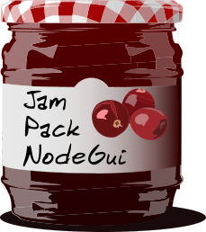

Jam Pack Nodegui
================

*Jam NodeGui applications into neat little packages.*

**Jam Pack NodeGui** is a packing tool for [NodeGui](https://github.com/nodegui/nodegui) applications.

It can aid in producing packages in the following formats:

* Zip
* AppImage (Linux)
* Debian (Linux)
* NSIS installer (Windows)
* DMG (macOS)

It aims to produce small packages which only include the files needed to run the application.

This tool has been spun off from my work on [Extraterm](https://extraterm.org/) and [NodeGui](https://github.com/nodegui/nodegui). -- Simon

Packaging Approach
==================

JPN is designed around some key guidelines:

* Keep the development file structure where possible
* Operate on a clean source tree
* Use bundling to minimize the size of your application and run-time files
* Whitelist files to include in the package, i.e. opt-in

The packaging process consists of a number of steps and is driven by a configuration file to customise each step.

Bundling your application into one file is recommended but not required. Bundling your application collects its dependencies into one file and separates them from any other test files or documentation that maybe be stored in your `node_modules` directory.

Why not use `macdeployqt`, `linuxdeployqt` and friends?
-------------------------------------------------------

Many tools for packaging non-C++ Qt applications like NodeGui with JS, try to rely on C++ oriented tools like `macdeployqt` or `linuxdeployqt` to do their work. These tools are often a poor fit because they are busy with solving C++ executable and library problems which appear when trying to create portable binaries which can run on end user systems. In the case of NodeGui applications this is problem has already been solved by the NodeGui developers. The pre-compiled binaries and libraries which are downloaded when running a tool like `npm` are already suitable for redistribution. That's just how `npm` works! By expending some effort to eliminate unnecessary files, we can package and ship the project's file structure, as used during development, as the final file structure used on end user machines.

Besides a much simpler packaging process another big benefit is fewer differences between the file layout at development time and that used by the end user. Libraries and files aren't shuffled around as much, relative file paths remain the same, therefore reducing the chance of things working during development but not for end users.

Installing
==========

JPN can be installed using `npm install --save jam-pack-nodegui` or `yarn add --dev jam-pack-nodegui` if you are using yarn.

Usage
=====
* Read the [Guide](guide.md)

License
=======

MIT

Developer
=========

Simon Edwards <simon@simonzone.com>
